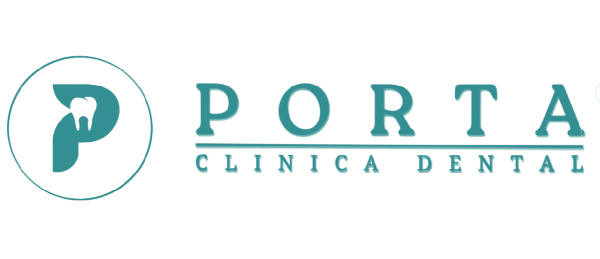

# 🦷 Clínica Dental PORTA

Bienvenido al repositorio oficial del sitio web de **Clínica Dental PORTA**, ubicada en el corazón de Tingo María. Este proyecto es una Single Page Application (SPA) moderna diseñada para conectar pacientes con servicios odontológicos de primera calidad.



## 🚀 Características Principales

*   **Diseño Moderno y Responsivo:** Interfaz limpia y adaptada a móviles y escritorio, con animaciones suaves y estética premium.
*   **Asistente Virtual con IA (Gemini):** Chatbot inteligente integrado que responde dudas sobre tratamientos, precios y horarios, manteniendo el contexto de la conversación.
*   **Agenda por WhatsApp:** Integración directa con WhatsApp para reservar citas, enviando un resumen automático de la pre-consulta con el bot.
*   **Secciones Dinámicas:** Información detallada de servicios, especialistas, casos de antes/después y ubicación interactiva.

## 🛠️ Tecnologías Empleadas

Este proyecto ha sido construido utilizando las mejores prácticas de desarrollo web moderno:

*   **Frontend:** [React](https://reactjs.org/) + [Vite](https://vitejs.dev/)
*   **Lenguaje:** [TypeScript](https://www.typescriptlang.org/) para un código robusto y seguro.
*   **Estilos:** [Tailwind CSS](https://tailwindcss.com/) para un diseño rápido y flexible.
*   **Inteligencia Artificial:** Integra la API de [Google Gemini 2.5](https://deepmind.google/technologies/gemini/) (vía SDK `@google/genai`) para el asistente virtual.
*   **Iconos:** SVG nativos optimizados.

## 📦 Instalación y Despliegue

### Requisitos Previos

*   Node.js (v18 o superior)
*   npm

### Pasos para correr localmente

1.  **Clonar el repositorio:**
    ```bash
    git clone https://github.com/RengiCodeMaster/clinicaDentalPorta.git
    cd clinicaDentalPorta
    ```

2.  **Instalar dependencias:**
    ```bash
    npm install
    ```

3.  **Configurar Variables de Entorno:**
    Crea un archivo `.env.local` en la raíz y añade tu API Key de Gemini:
    ```env
    VITE_GEMINI_API_KEY=tu_api_key_aqui
    ```

4.  **Iniciar el servidor de desarrollo:**
    ```bash
    npm run dev
    ```

## 🌐 Despliegue en Vercel

Este proyecto está optimizado para desplegarse en [Vercel](https://vercel.com/).
El archivo `vercel.json` incluido asegura el correcto enrutamiento de la SPA.

> **Nota:** Recuerda configurar la `VITE_GEMINI_API_KEY` en las variables de entorno de tu proyecto en Vercel para que el chatbot funcione en producción.

## 📞 Contacto

**Clínica Dental PORTA**
*   📍 Jr. José Prato 352, Tingo María.
*   📱 WhatsApp: [+51 919 639 809](https://wa.me/51919639809)

---
Desarrollado con ❤️ y código limpio.
